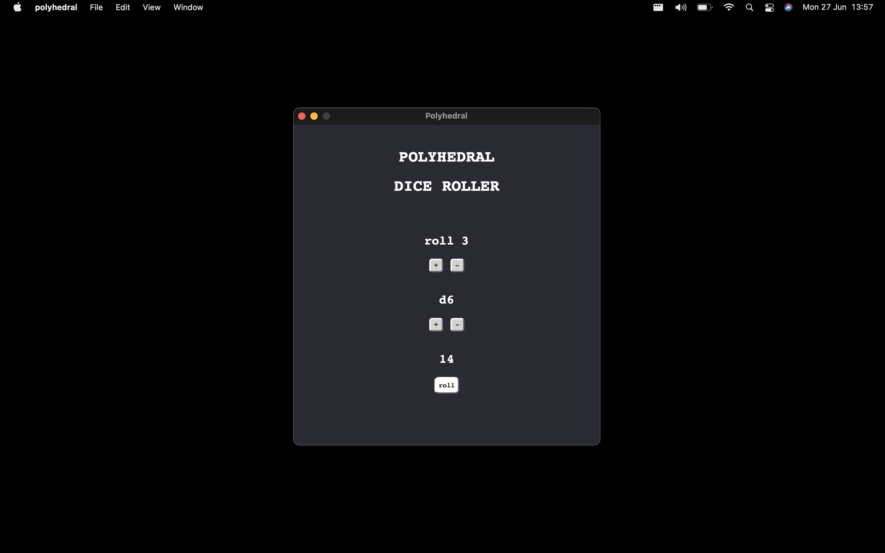

# Polyhedral

A dice rolling desktop app made with the Tauri framework.



## Prerequisites

```
node
yarn
rust
```

## Install

After cloning the repo, install node modules inside it with the command

```
yarn install
```

## Building on MacOS

To build for the x86_64 archtecture, run

```
yarn tauri build --target x86_64-apple-darwin
```

To build for M1 macs, run

```
yarn tauri build --target aarch64-apple-darwin
```

Or for a universal apple build, run

```
yarn tauri build --target universal-apple-darwin
```

## Building on other OSes

Follow these [instructions for a Windows executable](https://tauri.app/v1/guides/building/windows) or these [instructions for a deb package](https://tauri.app/v1/guides/building/debian).

## Recording dice scores?

Currently, there is no persistent storage after the app is closed, but I plan to add that feature in the near future.
